```text
█▓▒░ signal status: active
█▓▒░ last transmission: 2026
█▓▒░ location: bengaluru, in
```

i rebuild landmark papers from scratch — no frameworks, no shortcuts. **numpy first**, pytorch second, never sklearn. currently building multi-agent systems that argue with each other about air traffic.

springer-published · wilo-trained · 800+ tests written


## ╔═ active transmissions ═╗

<table width="100%">
<tr>
<td width="50%" valign="top">

### ◉ atc-guardian
`fastapi` `react 19` `langgraph` `pydantic ai` `crewai` `band sdk`

6 agents. 3 frameworks. 1 airspace. they argue about landing sequences so controllers don't have to. human-on-the-loop gate. emergency veto. regulator-ready audit export.

[`live demo →`](https://atc-guardian-frontend.vercel.app) · [`source ←`](https://github.com/VTongTV/ATC-Guardian) · `171 tests`

</td>
<td width="50%" valign="top">

### ◉ vigil-aI
`react 19` `vite 6` `fastapi` `yolov8n` `rapidocr` `sqlalchemy 2.0`

watches bengaluru traffic. catches 7 violation types. reads license plates. builds sha-256 evidence chains. fits in 4gb vram. flipkart gridlock 2.0 round 2.

[`live demo →`](https://vigil-ai-gules.vercel.app/dashboard) · [`source ←`](https://github.com/VTongTV/Vigil-AI) · `269 tests`

</td>
</tr>
</table>


## ╔═ the archive ═╗

> **19 papers. 31 years. zero frameworks.**
> every paper rebuilt from the original. no wrappers, no sklearn pipelines, no pretrained downloads.



<details>
<summary>█ classical · 1990–1998</summary>

| year | paper | repo |
|------|-------|------|
| 1990 | rnn · elman · where it all starts | [`RNN-from-scratch`](https://github.com/VTongTV/RNN-from-scratch) |
| 1998 | lenet-5 · lecun · the one that proved convolutions work | [`LeNet-5-scratch`](https://github.com/VTongTV/LeNet-5-scratch) |
| 1998 | naive bayes · lewis · independence holds less than you'd think | [`Naive-bayes-scratch`](https://github.com/VTongTV/Naive-bayes-scratch) |
| 1998 | svm · joachims · SMO algorithm, 3 kernels, VC-dimension | [`SVM-From-Scratch`](https://github.com/VTongTV/SVM-From-Scratch) |

</details>

<details>
<summary>█ embeddings · 2003–2014</summary>

| year | paper | repo |
|------|-------|------|
| 2003 | lda · blei · variational inference, variational EM | [`lda-from-scratch`](https://github.com/VTongTV/lda-from-scratch) |
| 2013 | word2vec · mikolov · CBOW + skip-gram, hierarchical softmax | [`word2vec-from-scratch`](https://github.com/VTongTV/word2vec-from-scratch) |
| 2014 | glove · pennington · co-occurrence, weighted least squares, 71.7% analogy | [`glove-from-scratch`](https://github.com/VTongTV/glove-from-scratch) |

</details>

<details>
<summary>█ nlp / sequence · 2014–2019</summary>

| year | paper | repo |
|------|-------|------|
| 2014 | seq2seq · sutskever · 4-layer deep LSTM, beam search | [`seq2seq-from-scratch`](https://github.com/VTongTV/seq2seq-from-scratch) |
| 2015 | bahdanau · bidirectional GRU, soft attention, maxout | [`bahdanau-attention-from-scratch`](https://github.com/VTongTV/bahdanau-attention-from-scratch) |
| 2017 | transformer · vaswani · full encoder-decoder, 217 commits | [`attention-from-scratch`](https://github.com/VTongTV/attention-from-scratch) |
| 2018 | elmo · peters · biLM, char CNN, highway, 6 downstream tasks | [`elmo-from-scratch`](https://github.com/VTongTV/elmo-from-scratch) |
| 2019 | bert · devlin · BERT-B/L, MLM+NSP, 131 tests | [`bert-from-scratch`](https://github.com/VTongTV/bert-from-scratch) |

</details>

<details>
<summary>█ vision · 2012–2021</summary>

| year | paper | repo |
|------|-------|------|
| 2012 | alexnet · krizhevsky · no frameworks at all. pure numpy/cupy | [`AlexNet-scratch`](https://github.com/VTongTV/AlexNet-scratch) |
| 2015 | resnet · he · ResNet-18→1202, CIFAR-10 6.43% error | [`Resnet-from-scratch`](https://github.com/VTongTV/Resnet-from-scratch) |
| 2015 | faster r-cnn · ren · RPN + fast R-CNN, anchor pyramid | [`faster-rcnn-from-scratch`](https://github.com/VTongTV/faster-rcnn-from-scratch) |
| 2015 | fcn · long · fully convolutional semantic segmentation | [`FCN-from-scratch`](https://github.com/VTongTV/FCN-from-scratch) |
| 2015 | u-net · ronneberger · valid convolutions, overlap-tile | [`U-net-from-scratch`](https://github.com/VTongTV/U-net-from-scratch) |
| 2018 | mobilenetv2 · sandler · inverted residuals, linear bottlenecks | [`MobileNetV2-from-scratch`](https://github.com/VTongTV/MobileNetV2-from-scratch) |
| 2021 | vit · dosovitskiy · patch embedding, class token, 252 tests | [`vision-transformer-from-scratch`](https://github.com/VTongTV/vision-transformer-from-scratch) |

</details>


## ╔═ published work ═╗

| | paper | venue | year |
|---|-------|-------|------|
| ● | dermatology ML | springer | 2025 |
| ● | AI-enhanced ERP | IEEE | 2025 |
| ● | AI in oncology | IEEE | 2025 |

## ╔═ where i've logged hours ═╗

**dscribe.ai / rebulk** · `swe intern` · full-stack + RAG + LLM chatbot · AWS/GCP

**wilo SE** · `ml engineering intern` · impeller sizing inverse model · pytorch/XGBoost/conformal prediction


<p align="center">
<a href="https://github.com/VTongTV"></a>
<a href="https://linkedin.com/in/vedant-tong"></a>
<a href="mailto:vedant.tong@example.com"></a>
</p>

<p align="center">
<code style="color:#333">signal decay // vtongtv</code>
</p>
