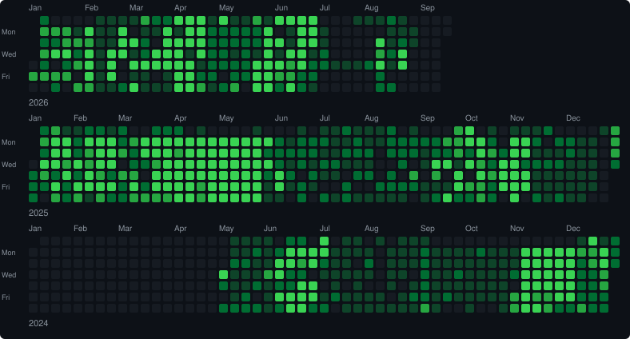
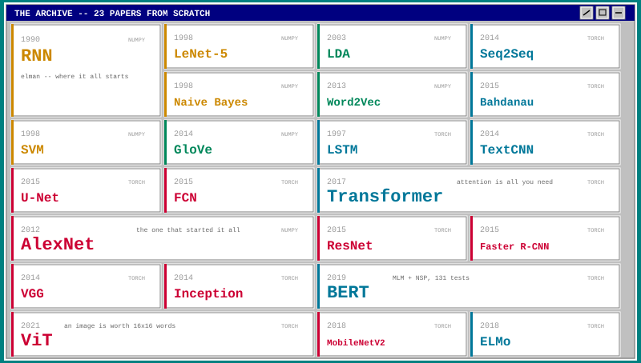

ml & full-stack intern @ wilo SE (pune). previously built rag chatbots + drone cv pipelines @ dscribe.ai (remote, usa). shipped 2 deployed ai systems -- air traffic control multi-agent platform and pune traffic violation detector. 3 publications (springer + 2x IEEE). patent pending. 23 landmark ml papers rebuilt from scratch, 800+ tests written. [leetcode knight 1954](https://leetcode.com/u/VT2077/).

### tech stack

  
  
  
  
  
  
  
  
  
  
  
  
  
  
  
  
  

<table width="100%">
<tr><td valign="top" width="25%"><b>ML / DL</b> XGBoost, LightGBM, CatBoost, YOLOv8, SAM, TabM, HuggingFace, LangChain, LlamaIndex</td>
<td valign="top" width="25%"><b>full-stack</b> Next.js 14, Node/Express, Vite 6, TailwindCSS v4, shadcn/ui, Three.js, Leaflet, CesiumJS</td>
<td valign="top" width="25%"><b>infra</b> GKE, Helm, SQLite (WAL), n8n, Prometheus, Grafana, NSIS, Git LFS, Electron</td>
<td valign="top" width="25%"><b>specialties</b> RAG pipelines, conformal prediction, SHAP, OCR, CV inference, circuit breakers, SSE streaming</td>
</tr>
</table>

### active projects

<table width="100%">
<tr>
<td width="50%" valign="top">

<b>atc-guardian</b> -- `langgraph` `pydantic ai` `crewai` `fastapi` `react 19` `leaflet`  
6 agents across 3 frameworks. adversarial safety reviewer re-derives every advisory against ICAO separation minima. human-on-the-loop gate. emergency veto. regulator-ready audit export. 184 tests, zero-credential offline mode.  
[<b>live</b>](https://atc-guardian-frontend.vercel.app) / [<b>source</b>](https://github.com/VTongTV/ATC-Guardian) / band of agents hackathon top 100

</td>
<td width="50%" valign="top">

<b>vigil-aI</b> -- `yolov8n` `rapidocr` `fastapi` `react 19` `sqlalchemy 2.0` `tailwindcss v4`  
7/7 traffic violation types. license plate OCR. sha-256 evidence chain. court-admissible per Indian Evidence Act s65B. VRAM-resident model serving fits 4gb. 269 tests.  
[<b>live</b>](https://vigil-ai-gules.vercel.app/dashboard) / [<b>source</b>](https://github.com/VTongTV/Vigil-AI) / flipkart gridlock 2.0 round 2

</td>
</tr>
</table>

### the archive -- 23 papers from scratch

### published

| | paper | venue | year |
|---|-------|-------|------|
| + | [baldness detection with AI/ML](https://doi.org/10.1007/s00403-025-04477-4) | springer -- archives of dermatological research | 2026 |
| + | [AI-enhanced ERP in higher education](https://doi.org/10.1109/ICSCDS65426.2025.11167478) | IEEE ICSCDS | 2025 |
| + | [AI/ML in oncology: systematic review](https://doi.org/10.1109/ICSCDS65426.2025.11167501) | IEEE ICSCDS | 2025 |

patent pending -- system for age-stratified androgenetic alopecia risk assessment

### experience

**wilo SE** -- `ml & full-stack intern` -- jan 2026 - present -- pune, in 
impeller sizing inverse model (sub-1mm MAE). tabM neural network + xgboost stacking. conformal prediction intervals. shap explainability. fastapi inference server (12 endpoints, SSE streaming). react + electron dashboard with 3d pump visualization. nsis installer. 828 commits.

**dscribe.ai / rebulk** -- `swe intern` -- jun 2025 - jan 2026 -- remote, ks, usa 
rag chatbot with multi-llm routing (claude/deepseek/kimi). qwen vision for handwriting ocr. segformer + depth anything v2 + 3dgs for drone stockpile volumetrics. next.js + cesiumjs dashboard. aws to gcp full-stack migration. gke deployment.

### achievements

gdg cloud lead -- sci-tech innovation hackathon winner -- sih 2025 finalist -- 11 gcp skill badges -- aws academy graduate

### pune right now

<!-- PUNE-WEATHER:START -->
<!-- weather data unavailable -->
<!-- PUNE-WEATHER:END -->

